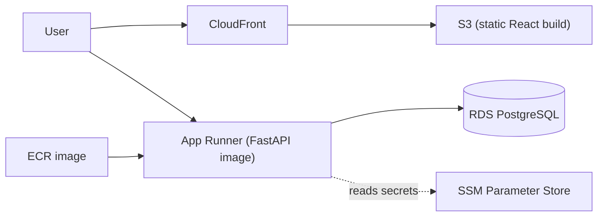

# AWS Deployment Guide (free-tier friendly)

This guide deploys ADA AI Platform to AWS using a **simple, low-cost** stack:

| Component | Service | Free-tier note |
|-----------|---------|----------------|
| Backend container | **App Runner** | Pay-per-use; **pause/delete** when not demoing |
| Database | **RDS PostgreSQL** (`db.t4g.micro`, single-AZ) | 750 hrs/month for 12 months |
| Container image | **ECR** | 500 MB storage for 12 months |
| Secrets | **SSM Parameter Store** (standard) | Free (avoid Secrets Manager, which is paid) |
| Frontend | **S3 + CloudFront** | CloudFront has a perpetual 1 TB/month free tier |

> **Cost trap to avoid:** do **not** add a NAT Gateway (~$32/month). The steps below keep you off it.



## Prerequisites

- An AWS account + [AWS CLI](https://aws.amazon.com/cli/) configured (`aws configure`)
- Docker installed and running
- These shell variables (adjust to taste):

```bash
export AWS_REGION=us-east-1
export AWS_ACCOUNT_ID=$(aws sts get-caller-identity --query Account --output text)
export ECR_REPO=ada-backend
export DB_PASSWORD='<choose-a-strong-password>'
```

---

## 1. Create the database (RDS PostgreSQL)

```bash
aws rds create-db-instance \
  --db-instance-identifier ada-db \
  --db-instance-class db.t4g.micro \
  --engine postgres \
  --allocated-storage 20 \
  --master-username ada \
  --master-user-password "$DB_PASSWORD" \
  --db-name ada_db \
  --publicly-accessible \
  --backup-retention-period 0 \
  --region "$AWS_REGION"
```

Wait until it is available, then capture the endpoint:

```bash
aws rds wait db-instance-available --db-instance-identifier ada-db --region "$AWS_REGION"
export DB_HOST=$(aws rds describe-db-instances --db-instance-identifier ada-db \
  --query 'DBInstances[0].Endpoint.Address' --output text --region "$AWS_REGION")
export DATABASE_URL="postgresql+psycopg2://ada:${DB_PASSWORD}@${DB_HOST}:5432/ada_db"
```

> `--publicly-accessible` keeps this guide simple. Lock the instance's security group to only the IPs/services that need it. The more secure alternative is to keep RDS private and reach it from App Runner via a **VPC connector** (no NAT Gateway required).

## 2. Apply the schema

```bash
psql "postgresql://ada:${DB_PASSWORD}@${DB_HOST}:5432/ada_db" \
  -f Implementation/backend/db/db-init/01_schema.sql
```

## 3. Store secrets in SSM Parameter Store

```bash
for kv in \
  "/ada/DATABASE_URL=$DATABASE_URL" \
  "/ada/GEMINI_API_KEY=<your-key>" \
  "/ada/GOOGLE_CSE_API_KEY=<your-key>" \
  "/ada/GOOGLE_CSE_CX=<your-cx>"; do
  name="${kv%%=*}"; value="${kv#*=}"
  aws ssm put-parameter --name "$name" --value "$value" --type SecureString \
    --overwrite --region "$AWS_REGION"
done
```

## 4. Build and push the backend image to ECR

The repo-root [`Dockerfile.backend`](Dockerfile.backend) already bundles both the backend and the `scraper/` package, so build from the repo root.

```bash
aws ecr create-repository --repository-name "$ECR_REPO" --region "$AWS_REGION" || true

aws ecr get-login-password --region "$AWS_REGION" | \
  docker login --username AWS --password-stdin "${AWS_ACCOUNT_ID}.dkr.ecr.${AWS_REGION}.amazonaws.com"

export IMAGE_URI="${AWS_ACCOUNT_ID}.dkr.ecr.${AWS_REGION}.amazonaws.com/${ECR_REPO}:latest"
docker build -f Dockerfile.backend -t "$IMAGE_URI" .
docker push "$IMAGE_URI"
```

## 5. Deploy the backend on App Runner

Create the service from the ECR image (console or CLI). Key settings:

- **Port:** `8000`
- **Health check path:** `/health`
- **Environment variables** (reference the SSM SecureStrings, or paste values):
  - `DATABASE_URL`, `GEMINI_API_KEY`, `GOOGLE_CSE_API_KEY`, `GOOGLE_CSE_CX`
  - `CORS_ALLOW_ORIGINS` = your CloudFront URL (set after step 6)
  - `AUTO_API_AUTH_MODE=write`

After it deploys, note the service URL (e.g. `https://xxxx.us-east-1.awsapprunner.com`) as `API_URL`.

## 6. Deploy the frontend (S3 + CloudFront)

```bash
cd Implementation/frontend
echo "VITE_API_URL=<API_URL from step 5>" > .env.production
npm install
npm run build                       # outputs dist/

export BUCKET=ada-frontend-$(date +%s)
aws s3 mb "s3://$BUCKET" --region "$AWS_REGION"
aws s3 sync dist/ "s3://$BUCKET" --delete
```

Then create a **CloudFront distribution** with that S3 bucket as the origin (use Origin Access Control so the bucket can stay private), and set the **default root object** to `index.html`. Note the CloudFront domain as `FRONTEND_URL`.

## 7. Close the loop

- Set App Runner's `CORS_ALLOW_ORIGINS` to `FRONTEND_URL` and redeploy.
- Confirm the SPA at `FRONTEND_URL` can reach the API.

---

## Teardown checklist (stop all billing)

```bash
# App Runner: delete the service (console or CLI)
# Frontend
aws s3 rb "s3://$BUCKET" --force --region "$AWS_REGION"
# CloudFront: disable, then delete the distribution (console)
# Database
aws rds delete-db-instance --db-instance-identifier ada-db \
  --skip-final-snapshot --delete-automated-backups --region "$AWS_REGION"
# Image registry
aws ecr delete-repository --repository-name "$ECR_REPO" --force --region "$AWS_REGION"
# Secrets
for n in DATABASE_URL GEMINI_API_KEY GOOGLE_CSE_API_KEY GOOGLE_CSE_CX; do
  aws ssm delete-parameter --name "/ada/$n" --region "$AWS_REGION" || true
done
```

Verify in the **Billing > Free Tier** dashboard that nothing unexpected is accruing.
