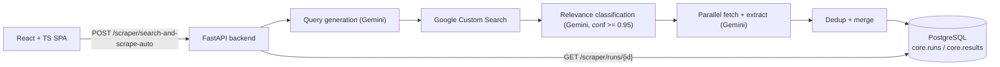

# ADA AI Platform

> Full-stack AI-powered web intelligence platform — turn a plain-English request into clean, structured data using Google Gemini and Google Custom Search.

[](https://fastapi.tiangolo.com/)
[](https://react.dev/)
[](https://www.postgresql.org/)
[](https://deepmind.google/technologies/gemini/)
[](https://www.docker.com/)

---

## Overview

ADA AI Platform takes a natural-language request (for example, *"restaurants in Vancouver with phone number and address"*) and runs a multi-stage AI pipeline that:

1. **Generates** focused Google search queries with Gemini.
2. **Searches** the web via Google Custom Search.
3. **Classifies** each result for relevance with Gemini (keeping only high-confidence matches).
4. **Scrapes** the surviving pages in parallel.
5. **Extracts** structured JSON (names, emails, phones, prices, etc.) with Gemini.
6. **Deduplicates** entities and **persists** them to PostgreSQL.

Built as part of the Applied Research Project (CSIS4495) at Douglas College — Team IntelliBase.

---

## Architecture



Key design points:

- **Run-based, concurrency-safe state.** Every request creates a row in `core.runs`. Intermediate files live in a per-run directory and final entities are written to `core.results` keyed by `run_id`, so concurrent users never overwrite each other.
- **Pluggable "verticals".** `Implementation/scraper/verticals/` defines a `VerticalIntelligenceModule` interface (see `base.py`); domain modules such as `education.py` add query anchoring, result validation, and tailored extraction instructions.
- **Self-generating API.** On startup the backend introspects the PostgreSQL `core` schema and auto-generates CRUD + search endpoints under `/auto/<table>` (`app/auto_generator.py`). If the database is unavailable, the app still boots in scraper-only mode.

---

## Tech Stack

| Layer | Technology |
|-------|------------|
| Frontend | React, TypeScript, Vite, Tailwind |
| Backend | Python, FastAPI, SQLAlchemy |
| Database | PostgreSQL |
| AI / Search | Google Gemini API, Google Custom Search API |
| Deployment | Docker, AWS (see [AWS_DEPLOYMENT.md](AWS_DEPLOYMENT.md)) |

---

## Project Structure

```
├── Implementation/
│   ├── backend/                     # FastAPI backend
│   │   ├── app/
│   │   │   ├── auto_generator.py     # Schema-introspecting auto CRUD API
│   │   │   ├── db.py                 # SQLAlchemy engine/session
│   │   │   ├── runs.py               # Run + result persistence helpers
│   │   │   └── schemas.py            # Pydantic schemas
│   │   ├── db/db-init/01_schema.sql  # core.runs / core.results schema
│   │   ├── tests/                    # pytest (pipeline + API, AI mocked)
│   │   ├── main.py
│   │   └── Dockerfile
│   ├── frontend/                    # React + TypeScript SPA
│   └── scraper/                     # Search → classify → scrape → extract pipeline
│       └── verticals/               # Pluggable domain modules
├── docker-compose.yml
└── AWS_DEPLOYMENT.md
```

---

## Getting Started

### Prerequisites

- Python 3.10+
- Node.js 18+
- PostgreSQL (or use Docker Compose)
- API keys: `GEMINI_API_KEY`, `GOOGLE_CSE_API_KEY`, `GOOGLE_CSE_CX`

### Option A — Docker (full stack)

```bash
cp Implementation/backend/.env.example Implementation/backend/.env
# edit the .env with real keys, then:
docker-compose up --build
```

The Postgres container applies `Implementation/backend/db/db-init/01_schema.sql` automatically on first boot.

### Option B — Local dev

Backend:

```bash
cd Implementation/backend
cp .env.example .env        # fill in real values
pip install -r requirements.txt
uvicorn main:app --reload   # http://localhost:8000/docs
```

Frontend:

```bash
cd Implementation/frontend
npm install
npm run dev                 # http://localhost:3000
```

### Running tests

```bash
cd Implementation/backend
pip install -r requirements.txt
pytest                      # AI/search clients are mocked; no network needed
```

---

## Environment Variables

| Variable | Description |
|----------|-------------|
| `DATABASE_URL` | Full PostgreSQL connection string (preferred) |
| `POSTGRES_HOST` / `POSTGRES_PORT` / `POSTGRES_DB` / `POSTGRES_USER` / `POSTGRES_PASSWORD` | Used to build the URL if `DATABASE_URL` is unset |
| `GEMINI_API_KEY` | Google Gemini API key |
| `GOOGLE_CSE_API_KEY` | Google Custom Search API key |
| `GOOGLE_CSE_CX` | Google CSE context ID |
| `CORS_ALLOW_ORIGINS` | Comma-separated allowlist of frontend origins |
| `AUTO_API_AUTH_MODE` | `none` \| `write` \| `full` (default `write`) |
| `AUTO_API_EXCLUDE` | Comma-separated tables to hide from the auto API |
| `VITE_API_URL` | Backend base URL (frontend build-time) |

> Security note: never commit a real `.env`. If a key is ever committed, rotate it — removing it from a file does not remove it from git history.

---

## Deployment

See [AWS_DEPLOYMENT.md](AWS_DEPLOYMENT.md) for a free-tier-friendly AWS setup (ECR + App Runner + RDS + S3/CloudFront), including a teardown checklist.

---

## License

MIT License
